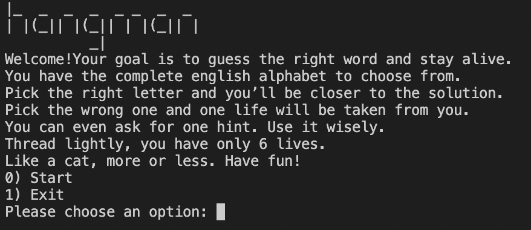
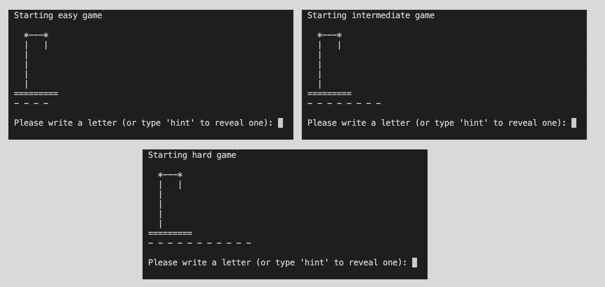

# Hangman 

This is a Python terminal game addressed to word games lovers. The main goal is to guess the mistery word before loosing all the given lives. The user can input their choices in the terminal, a number, a single letter or the word 'hint' depending on the stage of the game they are in and they will receive a response according to their pick. The game ends with a win or if they use all their lives without completing the word. Some art  has been added so that the hangman results more appealing and user friendly. 

Here is the live version of my project (!!!!!!add link once deployed)

___
## How to play

The game starts with a welcome screen where the user finds the title of the game and 3 options. They can go to the rules, start the game, or exit the game. To start the game the user needs to select the number matching the "start" option. At this point they are provided with new options with different levels as the game consists of 3 difficulty levels. There is an easy level where the word that they need to guess is a short, there is an intermediate level for medium lenght words and an hard level for long words. Once the user selects the preferred level, they are asked to confirm their choice before proceeding. When they are happy with their choice, the game can start. The user starts guessing letters and if they haven't used one already they can also ask for a hint so that a random letter is added to the screen for them. The user has only 1 hint per game and 6 lives, one life will be taken from them everytime they pick the wrong letter. The game ends either when the user successfully guesses the word while still alive or if they use all their lives and they die. A new set of option with the opportunity to start a new game or exit appears to them after every win or every defeat. 

___
## Features

### Existing Features
1. <u>Welcome page :</u> 
This is the first sceen the user faces when they start the game. They have 3 options: go to the rules, start the game or exit the game. The imput they can provide and will be accepted by the game is stricly one of the number given with the option. If they type in an invalid character an error message will be shown asking them to select a valid option

2. <u>Rules:</u> 
If the user wants to see the rules of the game they can do so selecting the number responding to that option. They will be shown a quick set of rules in order to understand how to play. Pick a letter, if it is present in the word well done, if not they will loose a life. They have limited lives and the option to ask for a little help, hint, only once during the game. From the rules screen they then have the option to start the game or exit.

3. <u>Exit:</u> 
This is just a quick message shown to the user when they want to exit the game and leave the terminal. 

4. <u>Play game:</u> 
If the user follows the instructions and decides to proceed in order to play a game they will be given the option to select their preferred difficulty level. The game has 3 levels: easy, intermediate and hard. The difference in levels depends on the lenght of the words they need to guess in order to win. Easy has short words (4/5 letters), intermediate has medium lenght words and hard has particularly long/hard words. When they pick the level they are then asked if they are happy with their choice and if they are,the game begins. 

5. <u>Input Validation:</u> 
Multiple aspects have been covered here in order to make sure the user enters a valid input. When they are asked to guess a letter, only one letter can be accepted. No numbers, no multiple letters, or any non-letter character will be accepted. If the user types a capital letter, that is accepted and the lower method has been used to automatically convert it to a lower character. 

6. <u>End of game:</u> 
The game can either end when the user has guessed all the letters not using all the lives hence staying alive or when they haven't completed the word but they have finished their lives. In the first scenario they won the game and a winning message will be displayes, in the second scenario they have lost and will be informed of the same via a "you have died" message. In both cases they will be asked if they want to play again and offered options (start or exit). 

7. <u>Word sheet:</u>
The words are loaded from https://docs.google.com/spreadsheets/d/1aRm2vaK6hhwBCVrdoNGkP30kM_ICPRoBVCcb7OAEG1s/edit?usp=sharing 

### Future Features
1. Add the option to select a word category to pick from (movies, books, songs)
2. Allow the user to guess the full mistery word at any point during the game. 

___
## Data Model

The game is mainly made of 2 classes: 

### Game class
The game class handles each time the user starts a new game. Every time a new game is started an instance of this class is created. The game class tracks the current word, correct guesses, number of lives, and updates each of these properties every time the user gives a letter. The game class has several functions. The main functions are `play` and `did_win`. The play function handles the main loop of the game. The did win function returns true or false and lets us show the correct screen after a game is over. 
### Words class
The Words class loads a list of words from a google sheet and then stores them in a list according to their difficulty. The Word class has a function to get a random word based on a difficulty, which is used by the game class when a new game starts. 
___
## Testing
I have tested the project manually in each part by playing the game multiple times. I have made sure multiple scenarios were covered as in what kind of input the user can use and what will and won't be accepted.
I have as well tested the code using the CI Python Linter and it showed no errors 

### Fixed Bugs
`1`

**Expected** :
When selecting a level one random word must be shown from the list provided in the googlesheet for that level

**Testing** :
While playing the game for testing I noticed how, at times, the word 'easy' would be randomly selected from the file even if that was not meant to be an actual word but only the category.  

**Result** :
A word not meant to be shown was being instead shown. 

**Fix** :
To fix this I had to skip the first row of words from the sheet (that simply define the level) and are not meant to be part of the game

`2`

**Expected** :
When loosing the game the final complete hangmam needs to be shown to the user. 

**Testing** :
I played the game multiple times loosing on purpose to test it.  

**Result** :
When loosing the game I noticed how the "Game over" message was showing at the right time but the hangman displayed was still incomplete (it still had a missing leg). This was confusing and deceptive as the user, seeing the image, could have been under the impression of having another guess. 

**Fix** :
To solve this I have added `self.print_lives()` so that when they loose the game a full hangman shows too making clear that they have used all the lives. 

### Remaining Bugs 
No bugs remaining

___
## Deployment
___
## Credits

1. The font for the name of the game comes from https://patorjk.com/software/taag/#p=display&f=Graffiti&t=Type%20Something%20

2. The Hangman art (hangmampics) comes from https://gist.github.com/chrishorton/8510732aa9a80a03c829b09f12e20d9c . 
I have then adapted it to my own taste and changed some of the character to completely remove syntax errors highlighted by the validator

3. The structure of the read me has been taken from code institute ultimate battleship walktrough project.